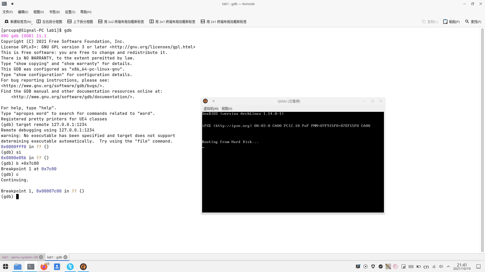
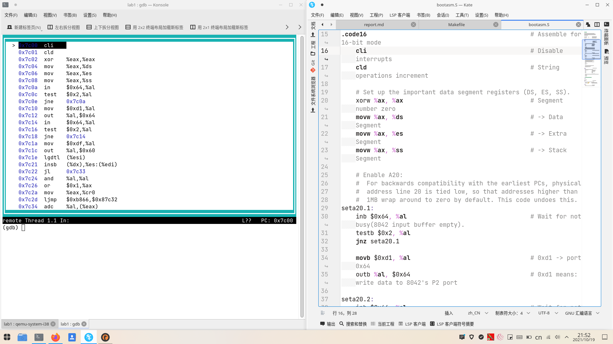

# 练习1
1. 执行make "V="后可看到如下输出：

	```
	clang -Ikern/init/ -fno-builtin -Wall -g -m32 -mno-sse -nostdinc  -fno-stack-protector -Ilibs/ -Ikern/debug/ -Ikern/driver/ -Ikern/trap/ -Ikern/mm/ -c kern/init/init.c -o obj/kern/init/init.o
	clang -Ikern/libs/ -fno-builtin -Wall -g -m32 -mno-sse -nostdinc  -fno-stack-protector -Ilibs/ -Ikern/debug/ -Ikern/driver/ -Ikern/trap/ -Ikern/mm/ -c kern/libs/readline.c -o obj/kern/libs/readline.o
	clang -Ikern/libs/ -fno-builtin -Wall -g -m32 -mno-sse -nostdinc  -fno-stack-protector -Ilibs/ -Ikern/debug/ -Ikern/driver/ -Ikern/trap/ -Ikern/mm/ -c kern/libs/stdio.c -o obj/kern/libs/stdio.o
	clang -Ikern/debug/ -fno-builtin -Wall -g -m32 -mno-sse -nostdinc  -fno-stack-protector -Ilibs/ -Ikern/debug/ -Ikern/driver/ -Ikern/trap/ -Ikern/mm/ -c kern/debug/kdebug.c -o obj/kern/debug/kdebug.o
	clang -Ikern/debug/ -fno-builtin -Wall -g -m32 -mno-sse -nostdinc  -fno-stack-protector -Ilibs/ -Ikern/debug/ -Ikern/driver/ -Ikern/trap/ -Ikern/mm/ -c kern/debug/kmonitor.c -o obj/kern/debug/kmonitor.o
	clang -Ikern/debug/ -fno-builtin -Wall -g -m32 -mno-sse -nostdinc  -fno-stack-protector -Ilibs/ -Ikern/debug/ -Ikern/driver/ -Ikern/trap/ -Ikern/mm/ -c kern/debug/panic.c -o obj/kern/debug/panic.o
	clang -Ikern/driver/ -fno-builtin -Wall -g -m32 -mno-sse -nostdinc  -fno-stack-protector -Ilibs/ -Ikern/debug/ -Ikern/driver/ -Ikern/trap/ -Ikern/mm/ -c kern/driver/clock.c -o obj/kern/driver/clock.o
	clang -Ikern/driver/ -fno-builtin -Wall -g -m32 -mno-sse -nostdinc  -fno-stack-protector -Ilibs/ -Ikern/debug/ -Ikern/driver/ -Ikern/trap/ -Ikern/mm/ -c kern/driver/console.c -o obj/kern/driver/console.o
	clang -Ikern/driver/ -fno-builtin -Wall -g -m32 -mno-sse -nostdinc  -fno-stack-protector -Ilibs/ -Ikern/debug/ -Ikern/driver/ -Ikern/trap/ -Ikern/mm/ -c kern/driver/intr.c -o obj/kern/driver/intr.o
	clang -Ikern/driver/ -fno-builtin -Wall -g -m32 -mno-sse -nostdinc  -fno-stack-protector -Ilibs/ -Ikern/debug/ -Ikern/driver/ -Ikern/trap/ -Ikern/mm/ -c kern/driver/picirq.c -o obj/kern/driver/picirq.o
	clang -Ikern/trap/ -fno-builtin -Wall -g -m32 -mno-sse -nostdinc  -fno-stack-protector -Ilibs/ -Ikern/debug/ -Ikern/driver/ -Ikern/trap/ -Ikern/mm/ -c kern/trap/trap.c -o obj/kern/trap/trap.o
	clang -Ikern/trap/ -fno-builtin -Wall -g -m32 -mno-sse -nostdinc  -fno-stack-protector -Ilibs/ -Ikern/debug/ -Ikern/driver/ -Ikern/trap/ -Ikern/mm/ -c kern/trap/trapentry.S -o obj/kern/trap/trapentry.o
	clang -Ikern/trap/ -fno-builtin -Wall -g -m32 -mno-sse -nostdinc  -fno-stack-protector -Ilibs/ -Ikern/debug/ -Ikern/driver/ -Ikern/trap/ -Ikern/mm/ -c kern/trap/vectors.S -o obj/kern/trap/vectors.o
	clang -Ikern/mm/ -fno-builtin -Wall -g -m32 -mno-sse -nostdinc  -fno-stack-protector -Ilibs/ -Ikern/debug/ -Ikern/driver/ -Ikern/trap/ -Ikern/mm/ -c kern/mm/pmm.c -o obj/kern/mm/pmm.o
	clang -Ilibs/ -fno-builtin -Wall -g -m32 -mno-sse -nostdinc  -fno-stack-protector -Ilibs/  -c libs/printfmt.c -o obj/libs/printfmt.o
	clang -Ilibs/ -fno-builtin -Wall -g -m32 -mno-sse -nostdinc  -fno-stack-protector -Ilibs/  -c libs/string.c -o obj/libs/string.o
	ld -m    elf_i386 -nostdlib -T tools/kernel.ld -o bin/kernel obj/kern/init/init.o obj/kern/libs/readline.o obj/kern/libs/stdio.o obj/kern/debug/kdebug.o obj/kern/debug/kmonitor.o obj/kern/debug/panic.o obj/kern/driver/clock.o obj/kern/driver/console.o obj/kern/driver/intr.o obj/kern/driver/picirq.o obj/kern/trap/trap.o obj/kern/trap/trapentry.o obj/kern/trap/vectors.o obj/kern/mm/pmm.o obj/libs/printfmt.o obj/libs/string.o
	clang -Iboot/ -fno-builtin -Wall -g -m32 -mno-sse -nostdinc  -fno-stack-protector -Ilibs/ -Os -nostdinc -c boot/bootasm.S -o obj/boot/bootasm.o
	clang -Iboot/ -fno-builtin -Wall -g -m32 -mno-sse -nostdinc  -fno-stack-protector -Ilibs/ -Os -nostdinc -c boot/bootmain.c -o obj/boot/bootmain.o
	clang -Itools/ -g -Wall -O2 -c tools/sign.c -o obj/sign/tools/sign.o
	clang -g -Wall -O2 obj/sign/tools/sign.o -o bin/sign
	ld -m    elf_i386 -nostdlib -N -e start -Ttext 0x7C00 obj/boot/bootasm.o obj/boot/bootmain.o -o obj/bootblock.o
	dd if=/dev/zero of=bin/ucore.img count=10000
	dd if=bin/bootblock of=bin/ucore.img conv=notrunc
	dd if=bin/kernel of=bin/ucore.img seek=1 conv=notrunc
	```

可以看到，生成ucore.img的主要过程为：编译C程序、链接、将引导程序写入到生成的ucore.img文件的第一个扇区（即MBR部分）、内核写入第二个扇区。
2. 一个有效的引导扇区位于磁盘前512字节，且最后两字节为0x55AA。

# 练习2
1. 调试可执行make debug，或者执行以下命令：

	```
	make
	qemu -S -s ./bin/ucore.img
	(新终端) gdb
	(gdb) target remote 127.0.0.1:1234
	b *0x7c00
	layout asm
	```



2. 设置断点后，qemu停留在0x7c00位置时反编译代码与bootasm.S部分对比如图。



从图中可知，执行指令基本相同，但标签、函数等标识被换成了真实的物理地址。同时，查阅资料可知，指令在反编译过程中被当成32位指令，因此16位寄存器变成了对应的32位寄存器（因为此时A20地址线还未打开，运行的指令不可能是32位的）。

# 练习3

1. 8086时代，计算机仅支持16位实模式；80386之后提供了32位保护模式的支持，但同时兼容了过去的16位实模式。早期计算机总线宽度为20位，通过段地址左移四位+偏移的方法进行寻址，而开启A20则解除了总线的20位限制，使其位宽扩至32位。

	打开A20的源码如下：

	```
	seta20.1:
		inb $0x64, %al                                  # Wait for not busy(8042 input buffer empty).
		testb $0x2, %al
		jnz seta20.1

		movb $0xd1, %al                                 # 0xd1 -> port 0x64
		outb %al, $0x64                                 # 0xd1 means: write data to 8042's P2 port

	seta20.2:
		inb $0x64, %al                                  # Wait for not busy(8042 input buffer empty).
		testb $0x2, %al
		jnz seta20.2

		movb $0xdf, %al                                 # 0xdf -> port 0x60
		outb %al, $0x60                                 # 0xdf = 11011111, means set P2's A20 bit(the 1 bit) to 1
    ```

	按照源码，打开A20地址线的方法为通过0x64端口向键盘控制器发送请求。但往往键盘缓冲区内有数据未处理，因此需处理数据直到缓冲区为空；之后向0x64端口写入0xd1，表示向P2写数据；最后在处理完缓存数据后向0x64端口写入0xdf，打开A20地址线。

	另外，经过查阅，打开A20地址线还能通过BIOS 0x15中断以及向0x92端口输出数据的方式，但通过键盘控制器是最稳妥的做法。Linux 0.11也采用了这种做法。

2. GDT相关源码如下：

	```
	# Switch from real to protected mode, using a bootstrap GDT
		# and segment translation that makes virtual addresses
		# identical to physical addresses, so that the
		# effective memory map does not change during the switch.
		lgdt gdtdesc
	-------------------------------------------------
	# Bootstrap GDT
	.p2align 2                                          # force 4 byte alignment
	gdt:
		SEG_NULLASM                                     # null seg
		SEG_ASM(STA_X|STA_R, 0x0, 0xffffffff)           # code seg for bootloader and kernel
		SEG_ASM(STA_W, 0x0, 0xffffffff)                 # data seg for bootloader and kernel

	gdtdesc:
		.word 0x17                                      # sizeof(gdt) - 1
		.long gdt                                       # address gdt
	```

	这里采用的是平坦模型，即所有段包含的地址范围均为0-0xffffffff，但权限不同。使用lgdt指令载入全局描述符表。

3. 在打开A20地址线、载入全局描述符表后，进入保护模式只需将cr0寄存器的第0位（即PE位）置1即可。之后使用长跳转至32位地址的办法清空流水线。

	```
	.set CR0_PE_ON,             0x1                     # protected mode enable flag
	.set PROT_MODE_CSEG,        0x8                     # kernel code segment selector

	movl %cr0, %eax
	orl $CR0_PE_ON, %eax
	movl %eax, %cr0

	# Jump to next instruction, but in 32-bit code segment.
	# Switches processor into 32-bit mode.
	ljmp $PROT_MODE_CSEG, $protcseg

	.code32                                             # Assemble for 32-bit mode
	protcseg:
		# Set up the protected-mode data segment registers
		movw $PROT_MODE_DSEG, %ax                       # Our data segment selector
		movw %ax, %ds                                   # -> DS: Data Segment
		movw %ax, %es                                   # -> ES: Extra Segment
		movw %ax, %fs                                   # -> FS
		movw %ax, %gs                                   # -> GS
		movw %ax, %ss                                   # -> SS: Stack Segment

		# Set up the stack pointer and call into C. The stack region is from 0--start(0x7c00)
		movl $0x0, %ebp
		movl $start, %esp
		call bootmain

		# If bootmain returns (it shouldn't), loop.
	spin:
		jmp spin
	```
