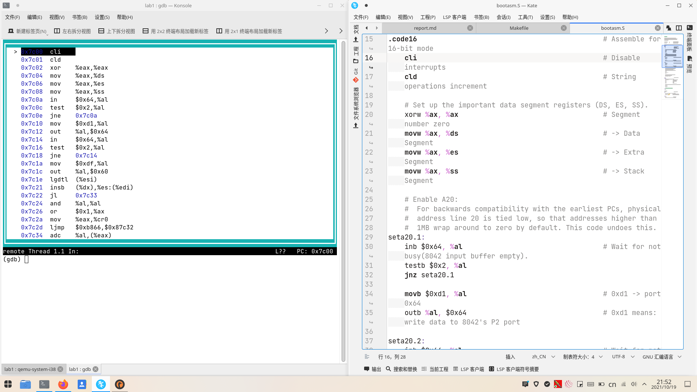

# 练习1
1. 执行make "V="后可看到如下输出：

	```
	clang -Ikern/init/ -fno-builtin -Wall -g -m32 -mno-sse -nostdinc  -fno-stack-protector -Ilibs/ -Ikern/debug/ -Ikern/driver/ -Ikern/trap/ -Ikern/mm/ -c kern/init/init.c -o obj/kern/init/init.o
	clang -Ikern/libs/ -fno-builtin -Wall -g -m32 -mno-sse -nostdinc  -fno-stack-protector -Ilibs/ -Ikern/debug/ -Ikern/driver/ -Ikern/trap/ -Ikern/mm/ -c kern/libs/readline.c -o obj/kern/libs/readline.o
	clang -Ikern/libs/ -fno-builtin -Wall -g -m32 -mno-sse -nostdinc  -fno-stack-protector -Ilibs/ -Ikern/debug/ -Ikern/driver/ -Ikern/trap/ -Ikern/mm/ -c kern/libs/stdio.c -o obj/kern/libs/stdio.o
	clang -Ikern/debug/ -fno-builtin -Wall -g -m32 -mno-sse -nostdinc  -fno-stack-protector -Ilibs/ -Ikern/debug/ -Ikern/driver/ -Ikern/trap/ -Ikern/mm/ -c kern/debug/kdebug.c -o obj/kern/debug/kdebug.o
	clang -Ikern/debug/ -fno-builtin -Wall -g -m32 -mno-sse -nostdinc  -fno-stack-protector -Ilibs/ -Ikern/debug/ -Ikern/driver/ -Ikern/trap/ -Ikern/mm/ -c kern/debug/kmonitor.c -o obj/kern/debug/kmonitor.o
	clang -Ikern/debug/ -fno-builtin -Wall -g -m32 -mno-sse -nostdinc  -fno-stack-protector -Ilibs/ -Ikern/debug/ -Ikern/driver/ -Ikern/trap/ -Ikern/mm/ -c kern/debug/panic.c -o obj/kern/debug/panic.o
	clang -Ikern/driver/ -fno-builtin -Wall -g -m32 -mno-sse -nostdinc  -fno-stack-protector -Ilibs/ -Ikern/debug/ -Ikern/driver/ -Ikern/trap/ -Ikern/mm/ -c kern/driver/clock.c -o obj/kern/driver/clock.o
	clang -Ikern/driver/ -fno-builtin -Wall -g -m32 -mno-sse -nostdinc  -fno-stack-protector -Ilibs/ -Ikern/debug/ -Ikern/driver/ -Ikern/trap/ -Ikern/mm/ -c kern/driver/console.c -o obj/kern/driver/console.o
	clang -Ikern/driver/ -fno-builtin -Wall -g -m32 -mno-sse -nostdinc  -fno-stack-protector -Ilibs/ -Ikern/debug/ -Ikern/driver/ -Ikern/trap/ -Ikern/mm/ -c kern/driver/intr.c -o obj/kern/driver/intr.o
	clang -Ikern/driver/ -fno-builtin -Wall -g -m32 -mno-sse -nostdinc  -fno-stack-protector -Ilibs/ -Ikern/debug/ -Ikern/driver/ -Ikern/trap/ -Ikern/mm/ -c kern/driver/picirq.c -o obj/kern/driver/picirq.o
	clang -Ikern/trap/ -fno-builtin -Wall -g -m32 -mno-sse -nostdinc  -fno-stack-protector -Ilibs/ -Ikern/debug/ -Ikern/driver/ -Ikern/trap/ -Ikern/mm/ -c kern/trap/trap.c -o obj/kern/trap/trap.o
	clang -Ikern/trap/ -fno-builtin -Wall -g -m32 -mno-sse -nostdinc  -fno-stack-protector -Ilibs/ -Ikern/debug/ -Ikern/driver/ -Ikern/trap/ -Ikern/mm/ -c kern/trap/trapentry.S -o obj/kern/trap/trapentry.o
	clang -Ikern/trap/ -fno-builtin -Wall -g -m32 -mno-sse -nostdinc  -fno-stack-protector -Ilibs/ -Ikern/debug/ -Ikern/driver/ -Ikern/trap/ -Ikern/mm/ -c kern/trap/vectors.S -o obj/kern/trap/vectors.o
	clang -Ikern/mm/ -fno-builtin -Wall -g -m32 -mno-sse -nostdinc  -fno-stack-protector -Ilibs/ -Ikern/debug/ -Ikern/driver/ -Ikern/trap/ -Ikern/mm/ -c kern/mm/pmm.c -o obj/kern/mm/pmm.o
	clang -Ilibs/ -fno-builtin -Wall -g -m32 -mno-sse -nostdinc  -fno-stack-protector -Ilibs/  -c libs/printfmt.c -o obj/libs/printfmt.o
	clang -Ilibs/ -fno-builtin -Wall -g -m32 -mno-sse -nostdinc  -fno-stack-protector -Ilibs/  -c libs/string.c -o obj/libs/string.o
	ld -m    elf_i386 -nostdlib -T tools/kernel.ld -o bin/kernel obj/kern/init/init.o obj/kern/libs/readline.o obj/kern/libs/stdio.o obj/kern/debug/kdebug.o obj/kern/debug/kmonitor.o obj/kern/debug/panic.o obj/kern/driver/clock.o obj/kern/driver/console.o obj/kern/driver/intr.o obj/kern/driver/picirq.o obj/kern/trap/trap.o obj/kern/trap/trapentry.o obj/kern/trap/vectors.o obj/kern/mm/pmm.o obj/libs/printfmt.o obj/libs/string.o
	clang -Iboot/ -fno-builtin -Wall -g -m32 -mno-sse -nostdinc  -fno-stack-protector -Ilibs/ -Os -nostdinc -c boot/bootasm.S -o obj/boot/bootasm.o
	clang -Iboot/ -fno-builtin -Wall -g -m32 -mno-sse -nostdinc  -fno-stack-protector -Ilibs/ -Os -nostdinc -c boot/bootmain.c -o obj/boot/bootmain.o
	clang -Itools/ -g -Wall -O2 -c tools/sign.c -o obj/sign/tools/sign.o
	clang -g -Wall -O2 obj/sign/tools/sign.o -o bin/sign
	ld -m    elf_i386 -nostdlib -N -e start -Ttext 0x7C00 obj/boot/bootasm.o obj/boot/bootmain.o -o obj/bootblock.o
	dd if=/dev/zero of=bin/ucore.img count=10000
	dd if=bin/bootblock of=bin/ucore.img conv=notrunc
	dd if=bin/kernel of=bin/ucore.img seek=1 conv=notrunc
	```

可以看到，生成ucore.img的主要过程为：编译C程序、链接、将引导程序写入到生成的ucore.img文件的第一个扇区（即MBR部分）、内核写入第二个扇区。
2. 一个有效的引导扇区位于磁盘前512字节，且最后两字节为0x55AA。

# 练习2
1. 调试可执行make debug，或者执行以下命令：

	```
	make
	qemu -S -s ./bin/ucore.img
	(新终端) gdb
	(gdb) target remote 127.0.0.1:1234
	b *0x7c00
	layout asm
	```


2. 设置断点后，qemu停留在0x7c00位置时反编译代码与bootasm.S部分对比如图。



从图中可知，执行指令基本相同，但标签、函数等标识被换成了真实的物理地址。同时，查阅资料可知，指令在反编译过程中被当成32位指令，因此16位寄存器变成了对应的32位寄存器（因为此时A20地址线还未打开，运行的指令不可能是32位的）。

